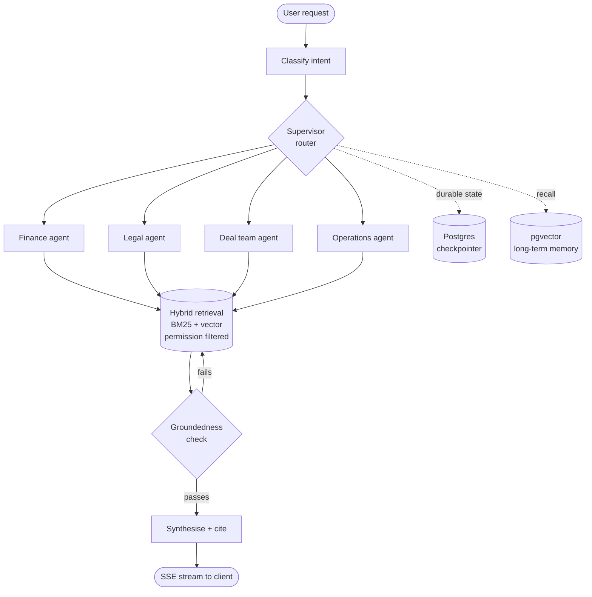

<!--
  SETUP
  1. Create a PUBLIC repo named EXACTLY your GitHub username.
  2. Put this file at the root as README.md.
  3. It renders at the top of github.com/<your-username>.
-->

 

`Technical Lead` · `6+ yrs engineering` · `4+ yrs LLM systems` · `15+ agents in production`

---

##  About

- Technical lead on an enterprise AI platform for a **global infrastructure investment firm**
- One entry point routing staff requests across **15+ specialised agents** over confidential deal, legal and financial data
- I spend my time on what doesn't demo well: **failed tool calls mid-plan**, permission-scoped retrieval, and knowing whether last week's prompt change made things worse
- Earlier work: **+40%** ticket-assignment accuracy, **−60%** manual operational processes

---

##  Tech Stack

**Core**

**AI & Agents**

**ML & Data**

**Frontend & Tooling**

<b>📋 The full breakdown</b>

 

| Area | Tools |
| --- | --- |
| **Agents** | LangGraph, LangChain, AutoGen, CrewAI, ReAct, Plan-and-Execute, MCP, A2A, tool calling, agent memory, durable checkpointing, human-in-the-loop |
| **Retrieval** | Hybrid BM25 + HNSW, query rewriting, relevance grading, groundedness checks, reranking, permission filtering, Azure AI Search, pgvector, FAISS, LlamaIndex |
| **Models** | Anthropic Claude, OpenAI / Azure OpenAI, Cohere, xAI, Hugging Face, LiteLLM, structured outputs, LoRA / QLoRA / PEFT, RLHF |
| **Evaluation** | Langfuse, regression and golden datasets, groundedness checks, retrieval precision and recall, tool-selection accuracy, p50/p95 latency, token and cost budgeting |
| **Backend** | Python, FastAPI, Django / DRF, async, SQLAlchemy 2, SSE streaming, PostgreSQL, Redis, Alembic, Docker, CI/CD |
| **Cloud** | Microsoft Foundry (Foundry SDK, project-scoped deployments, region-pinned for data residency), Azure App Service, AI Search, Document Intelligence, Blob Storage, Entra ID, AWS |
| **Classical ML** | PyTorch, TensorFlow, CNN, YOLO, Vision Transformer, ARIMA, LSTM, signal processing |

---

##  How the orchestrator fits together

---

##  What I build

| | |
| --- | --- |
| 🧭 **Orchestration** | LangGraph supervisor routing to department-scoped sub-agents. Postgres checkpointing so long runs survive interruption, parallel fan-out where the plan allows, resume after mid-flow clarification without re-querying agents that already answered. |
| 🔍 **Retrieval** | Hybrid BM25 + vector across department indices, metadata filtered so retrieval stays inside the user's entitlements. A wildcard probe fires first, so the agent tells *"you don't have access"* apart from *"nothing matched"* — identical to a user, completely different problems. |
| 🧠 **Memory** | Short-term on a hybrid time-and-turn window. Long-term on pgvector with a distance gate that stops cold-start false recalls. |
| 🔌 **Tooling** | MCP connector platform where users attach their own tool servers via per-user OAuth, so agents work against each person's real workspace instead of a fixed tool list. |
| 📊 **Evaluation** | Tracing every plan step, tool call and retrieval, then running regression sets against tool-selection accuracy, groundedness, failure rate and p95 latency. |

---

<b>🔬 Before the LLM wave — four years of applied ML</b>

 

- **Network quality forecasting** — 250+ cell parameters across mobile towers, joined with weather data to model propagation effects like atmospheric ducting, predicting which RF parameters to change before quality dropped
- **Wearables** — gesture classification from smartwatch IMU streams, heart screening from ECG and PPG signals
- **Audio screening** — cough-based TB and COVID-19 detection, owning data engineering through to model training
- **Vision** — CNN and YOLO for wildlife monitoring, Vision Transformer for geospatial classification

---

### Open to conversations about agent architecture, retrieval and production LLM systems.

